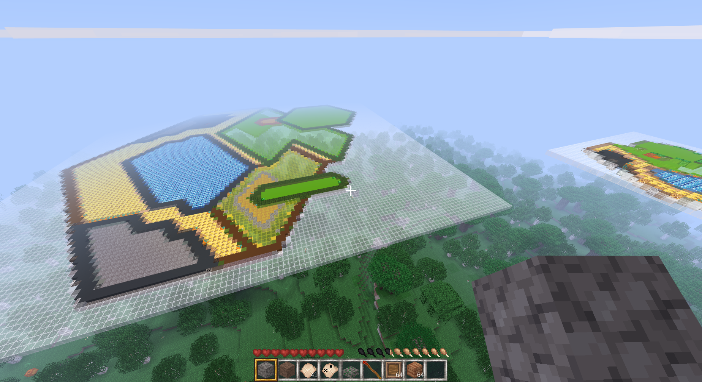
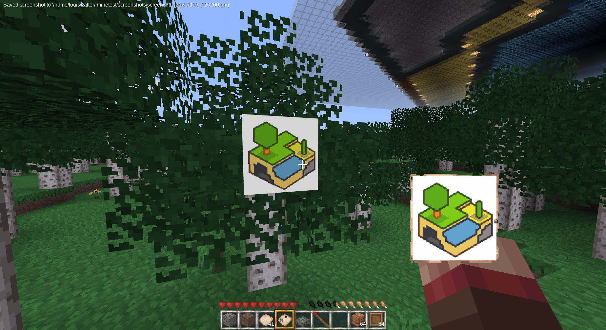

# MineClone2 MapArt

This is a python3 project you can use with the [MineClone2](https://git.minetest.land/MineClone2/MineClone2) game for [Minetest](https://github.com/minetest/minetest).

This project take an image and output a [WorldEdit](https://github.com/Uberi/Minetest-WorldEdit) shematic featuring MineClone2 blocks that matched the colors of image the best.





## Usage

### Basic Use

First, clone this project on your computer:

```sh
git clone https://github.com/AFCMS/MineClone2_MapArt
cd ./MineClone2_MapArt
```

Make sure dependencies are installed:
```sh
pip install -r requirements.txt
```

Run the main script on an image:
```sh
python3 ./create_map.py path-to-image path-output
```

You will get a WorldEdit shematic at `path-output`.

### Advanced Use

#### Regenerate `generate_json_blocks/availlable_blocks.json` and `block_colors.json`

These files may not be 100% up to date with MineClone2 master branch then you clone the repository, or you may want to use an old MineClone2 version.

In these cases, you will need to regenerate them:

First of all, you will need to update the list of survival-usable solid construction blocks:

Link the generate_json_blocks mod to the mods folder of your minetest installation.
Then, create a world with the MineClone2 game, enable the mod on it and jaunch the game.
The game should close after the media loading part.
You should now notice that the `availlable_blocks.json` in the `generate_json_blocks` folder has changed.

Then, you should now calculate the average color of each texture of each availlable block:

Run the `create_block_colors.py` file with the path where MineClone2 is installed as param.

```sh
python3 create_block_colors.py /path-to-mineclone2
```

It should output something like that:

```
Finding files...
Files: 233
```

You should also notice that the `block_colors.json` file has been updated.

You can now convert images that will make use of the all new `block_colors.json` file.


